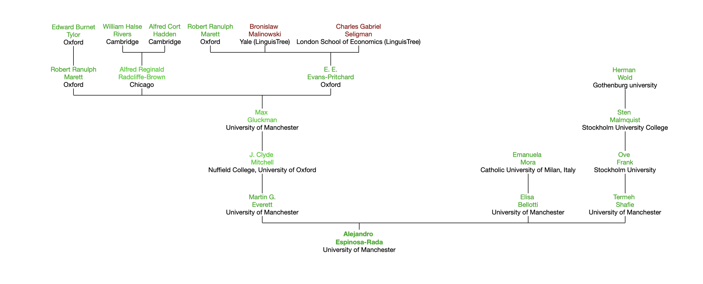

# Alejandro Espinosa-Rada

My name is [Alejandro Espinosa-Rada](https://www.aespinosarada.com) and I am a Postdoctoral Researcher at the [Social Networks Lab in ETH Zürich](https://sn.ethz.ch). Before arriving in Zürich, I did my PhD in Sociology at the [Mitchell Centre for Social Network Analysis](https://www.socialsciences.manchester.ac.uk/mitchell-centre/) at the University of Manchester. Also, I was an adjunct assistant professor in which I taught courses related to social network analysis at the Departments of Sociology ([PUC](https://sociologia.uc.cl) and [UAH](http://sociologia.uahurtado.cl)), the Department of Computer Science ([PUC](https://dcc.ing.puc.cl)), and the Department of History ([USACH](https://www.historia.usach.cl)). 

Main areas of interests: Group Dynamics, Sociology of Social Networks, Sociology of Science and Knowledge/Science of Science/Social Studies of Science and Technology, and Network Modelling.

You can also check [Knitting Networks](https://anchor.fm/tejiendoredes), the podcast of the Social Network Science (*chapters in Spanish or English*) hosted by [Francisca Ortiz](https://www.research.manchester.ac.uk/portal/francisca.ortiz.html) and myself. The podcast is sponsored by the *International Network for Social Network Analysis* [(INSNA)](https://www.insna.org/news/knitting-networks-podcast). 

## Other projects:

- Co-PI at the *Social Networks and Socio-ecological Sustainability Project* [(SNA-SES)](https://sna-ssla.netlify.app/). Project funded by FONDECYT program N°1220560

## Academic Tree:

